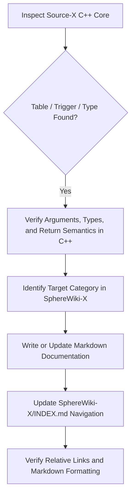

# SphereWiki-X Documentation Maintenance Skill

This skill defines the technical standards, workflows, and rules of engagement for AI coding agents and scripters maintaining, extending, and auditing the **`SphereWiki-X/`** documentation repository.

---

## 1. Core Principles & Architecture

### 1.1 Golden Source of Truth
Whenever engine behavior, keywords, triggers, or flags are in doubt, the **C++ source code** in `Source-X/src/` is the absolute authority:
- **Function tables**: `Source-X/src/tables/*_functions.tbl` (`CObjBase_functions.tbl`, `CChar_functions.tbl`, `CItem_functions.tbl`, `CClient_functions.tbl`, `CSector_functions.tbl`, `CParty_functions.tbl`, `CItemStone_functions.tbl`, `CScriptObj_functions.tbl`)
- **Property tables**: `Source-X/src/tables/*_props.tbl`
- **Engine definitions**: `Source-X/src/game/items/CItem.h`, `CChar.h`, `CRegion.h`, `CSector.h`, `item_types.h`
- **Expression parsing**: `Source-X/src/common/CScriptObj.cpp`, `CExpression.cpp`
- **Historical changelogs**: `Source-X/Changelog.txt`

### 1.2 Shard Neutrality Rule
- **`SphereWiki-X/` is 100% generic for the global SphereServer community**.
- **NEVER** introduce shard-specific customizations (e.g. custom quest systems, shard-specific tags, custom combat mechanics) into `SphereWiki-X/`.
- Shard-specific systems belong strictly in `SphereServer/docs/` or `SphereServer/scripts/`.

### 1.3 Preservation of Credits
- Always maintain and respect attribution to the original SphereServer creators, community developers, wiki authors, and tooling editors (**RayIde**, Gray/Menace, Shadowalker, Ran, ShiryuX, Coruja, Ben, etc.) in `SphereWiki-X/CREDITS.md` and tool READMEs.

---

## 2. Documentation Standards by Category

### 2.1 Section Blocks (`SphereWiki-X/sections/`)
Each section block file (`ITEMDEF.md`, `CHARDEF.md`, `MULTI-CONTAINERS.md`, etc.) must specify:
1. **Header format & naming convention** (`[BLOCKNAME identifier]`).
2. **Mandatory & optional properties table** (Access: R, W, R/W, Default value).
3. **Valid sub-blocks & triggers** callable inside the block.
4. **Memory structure & engine unions** (especially for `MORE1/2/P/X/Y/Z/M` and `TDATA1..4`).
5. **Practical, working SphereScript examples**.

### 2.2 Triggers (`SphereWiki-X/triggers/`)
Every trigger documentation entry must explicitly detail:
- **Execution Context**:
  - `DEFAULT` (`this`): The exact C++ object class running the trigger.
  - `SRC`: The initiator / actor of the event.
  - `ARGO`: Secondary object reference (weapon, container, target item, corpse, etc.).
  - `ACT`: Character's action target (`m_Act_UID`).
  - `REGION` / `SECTOR`: Environment references when applicable.
- **Input Arguments (`IN`)**: `ARGN1`, `ARGN2`, `ARGN3`, `ARGS`, `ARGO`.
- **Output Modifications (`OUT`)**: Which arguments can be modified before engine execution.
- **Return Values (`RET`)**:
  - `RETURN 0` (or `TRIGRET_RET_DEFAULT`): Allow normal engine processing.
  - `RETURN 1` (or `TRIGRET_RET_TRUE`): Cancel/block action.
  - `RETURN 2` (or `TRIGRET_RET_HALF`): Specific bypass or custom handler.

### 2.3 Actionable Verbs & Keywords (`SphereWiki-X/keywords/`)
- Every verb found in `Source-X/src/tables/*_functions.tbl` must have a corresponding entry in the relevant markdown file.
- Table format: `| Verb / Method | Arguments | Returns | Description |`.
- Document whether the verb takes effect immediately, pushes a packet to clients, or modifies object timers.

### 2.4 Flags & Bitmasks (`SphereWiki-X/flags/`)
- Document hex values, bit positions, and semantic effects for all bitmasks (`ATTR_*`, `STATF_*`, `CAN_*`, `CAN_I_*`, `DAM_*`, `MEMORY_*`, `REGION_FLAG_*`, `SKF_*`, etc.).
- Explicitly note which flags are persistent (saved to disk in world save files) and which are transient runtime flags.

---

## 3. Maintenance & Audit Workflow

When auditing or adding new documentation:

1. **Grep Engine Source**: Look up the symbol in `Source-X/src/` to confirm arguments, side-effects, and parser flags.
2. **Update Markdown File**: Format tables using standard GitHub-flavored Markdown.
3. **Verify Index**: Ensure the file is linked properly in `SphereWiki-X/INDEX.md`.
4. **Synchronize Skill / Plugin**: If new keywords or triggers were added, update:
   - `SphereWiki-X/agent-guidelines/skills/sphereserver-scripting-lang/SKILL.md`
   - `SphereWiki-X/vscode-plugin/spherescript-scripter/syntaxes/spherescript.tmLanguage.json`
   - `SphereWiki-X/vscode-plugin/spherescript-scripter/snippets/spherescript.snippets.json`
